# Docx Healthcare Platform - System Design

> **Last Updated**: January 30, 2026  
> **Status**: Active Development  
> **Version**: 1.0.0

---

## Table of Contents

1. [Overview](#overview)
2. [Architecture](#architecture)
3. [Tech Stack](#tech-stack)
4. [User Roles](#user-roles)
5. [Core Flows](#core-flows)
6. [Database Schema](#database-schema)
7. [API Reference](#api-reference)
8. [Security & Compliance](#security--compliance)

---

## Overview

Docx is a doctor-first healthcare SaaS platform that enables:

- **Doctors**: Manage patients, conduct consultations, generate prescriptions
- **Receptionists**: Handle appointments, enter vitals, manage billing
- **Patients**: Book appointments, view records, receive prescriptions

### Design Principles

1. **Speed-First UI**: Doctors see 50+ patients/day. Every click counts.
2. **Data Integrity**: All operations persist immediately. No mock data in production.
3. **Incremental Delivery**: Ship working features weekly, iterate based on feedback.
4. **Offline-Ready Architecture**: Design for future Tauri desktop app with sync.

---

## Architecture

### High-Level System Architecture

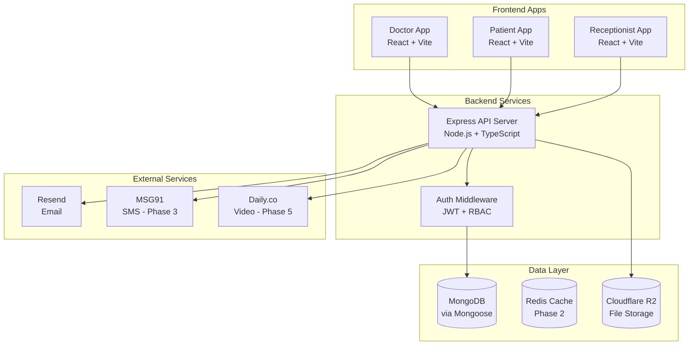

### Request Flow

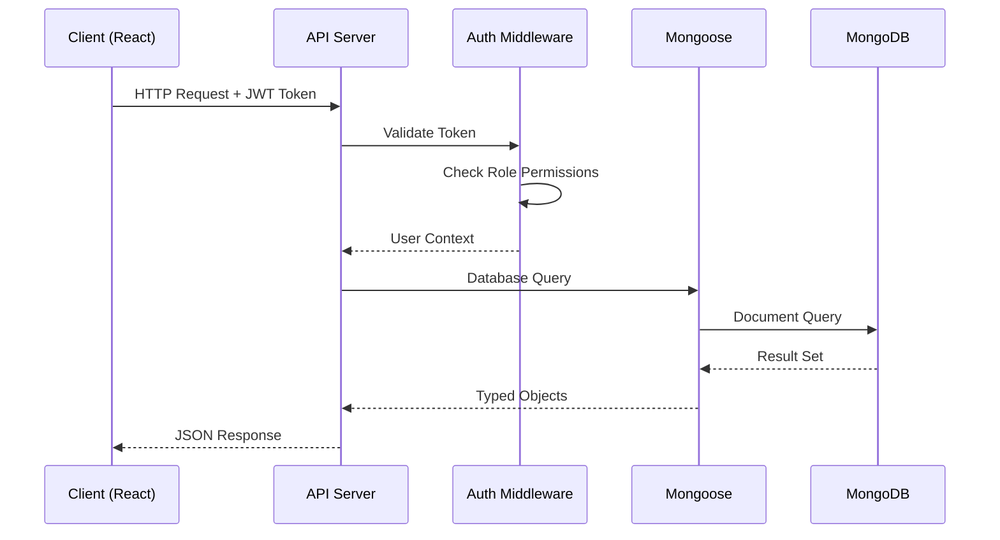

---

## Tech Stack

### Decisions & Rationale

| Layer | Technology | Why This Choice |
|-------|------------|-----------------|
| **Frontend** | React 19 + Vite + TypeScript | Fast HMR, CRA is deprecated, team knows React |
| **State Management** | TanStack Query + Zustand | Query for server state caching, Zustand for UI state |
| **Styling** | CSS Modules | Already implemented, works well, zero runtime cost |
| **Backend** | Node.js + Express + TypeScript | Existing codebase, proven, good ecosystem |
| **ODM** | Mongoose | Schema validation, strong typing, familiar DX |
| **Database** | MongoDB | Flexible documents, horizontal scaling |
| **Auth** | JWT (access) + Refresh Tokens | Stateless, scalable, standard practice |
| **File Storage** | Cloudflare R2 | S3-compatible, no egress fees, cheap |
| **Email** | Resend | Simple API, good deliverability, free tier |
| **PDF Generation** | React-PDF | Component-based templates, client-side rendering |
| **Deployment** | Vercel (web) + Railway (API) | Fast deploys, good free tiers, auto-scaling |

### Future Additions (Not in MVP)

| Technology | Purpose | When |
|------------|---------|------|
| Tauri | Desktop app with offline | Phase 4+ |
| Redis | Caching, rate limiting | When scale demands |
| Daily.co | Video consultations | Phase 5 |
| OpenAI API | AI autocomplete, chatbot | Phase 5+ |

---

## User Roles

### Role Permissions Matrix

| Permission | Doctor | Receptionist | Patient |
|------------|--------|--------------|---------|
| View own profile | ✅ | ✅ | ✅ |
| View patient list | ✅ | ✅ | ❌ |
| Add/edit patients | ✅ | ✅ | ❌ |
| Create appointments | ✅ | ✅ | ✅ (own) |
| View appointments | ✅ (own) | ✅ (all) | ✅ (own) |
| Conduct consultations | ✅ | ❌ | ❌ |
| Enter vitals | ✅ | ✅ | ❌ |
| View medical history | ✅ | 👁️ (view only) | ✅ (own) |
| Generate prescriptions | ✅ | ❌ | ❌ |
| Manage billing | ✅ | ✅ | ❌ |
| View analytics | ✅ | ❌ | ❌ |

---

## Core Flows

### 1. Authentication Flow

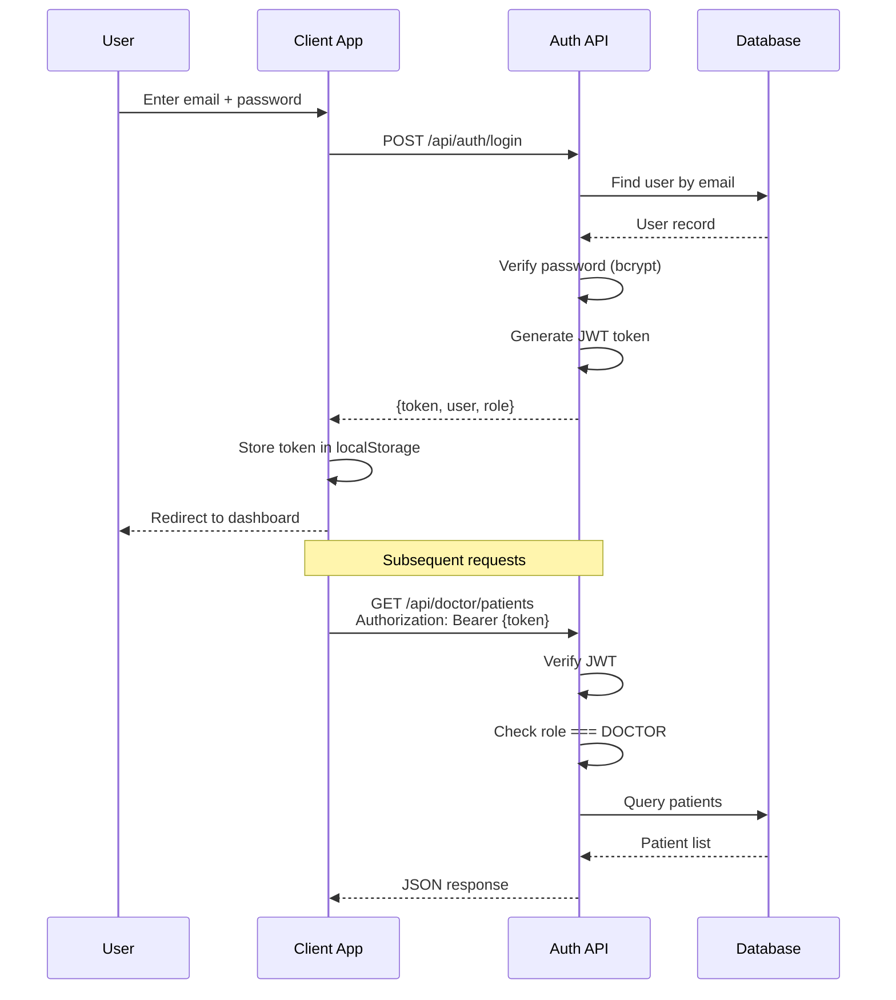

### 2. Patient CRUD Lifecycle

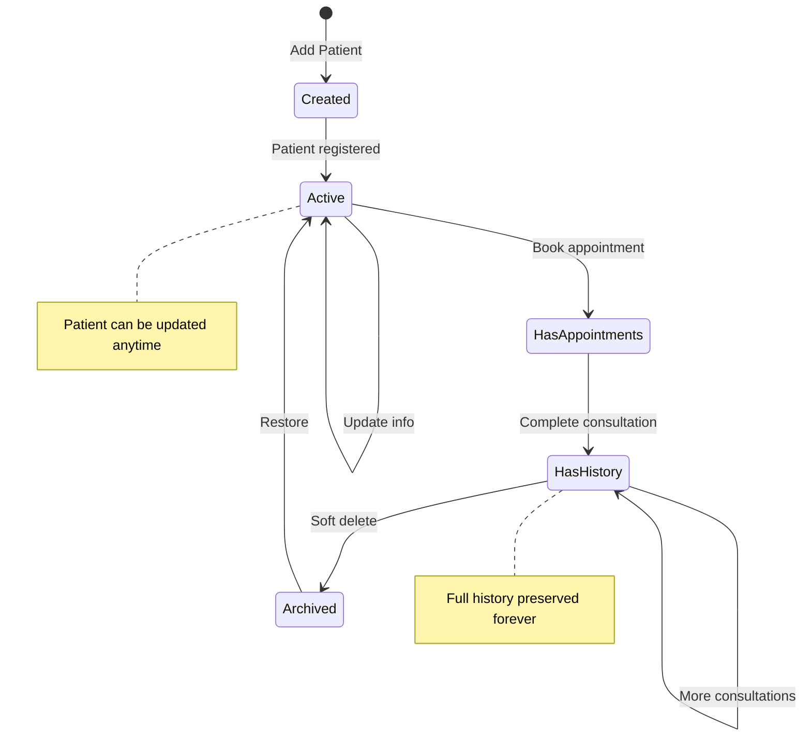

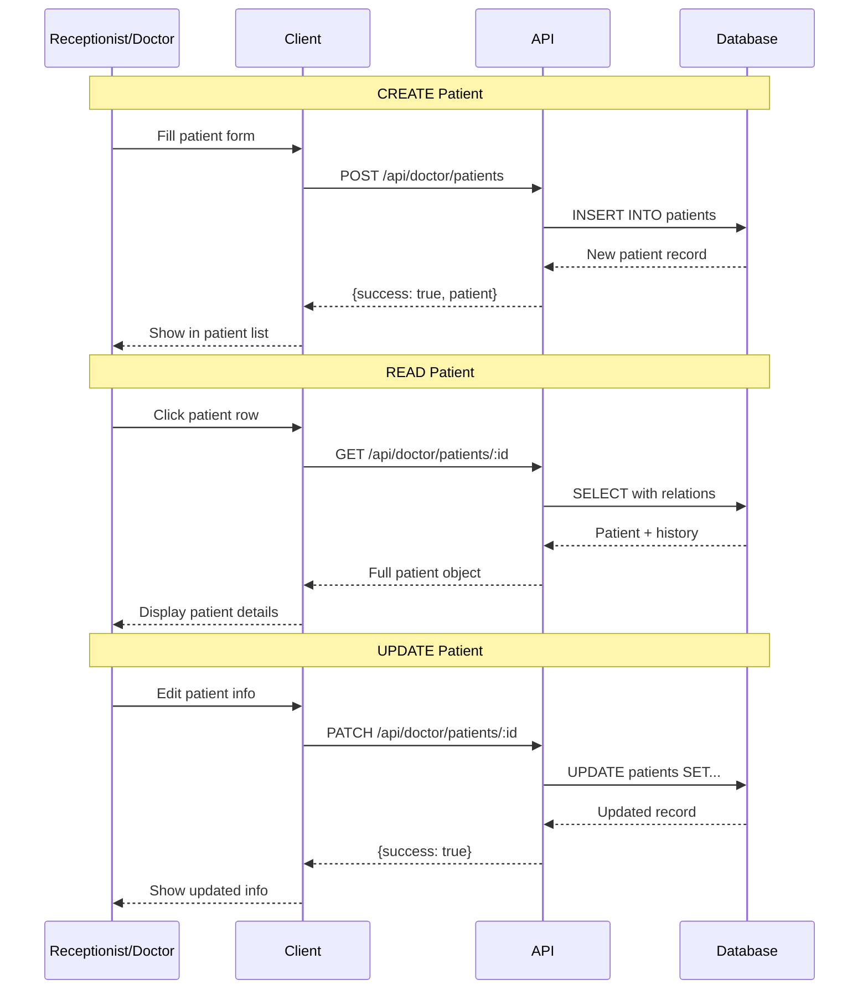

### 3. Appointment Lifecycle

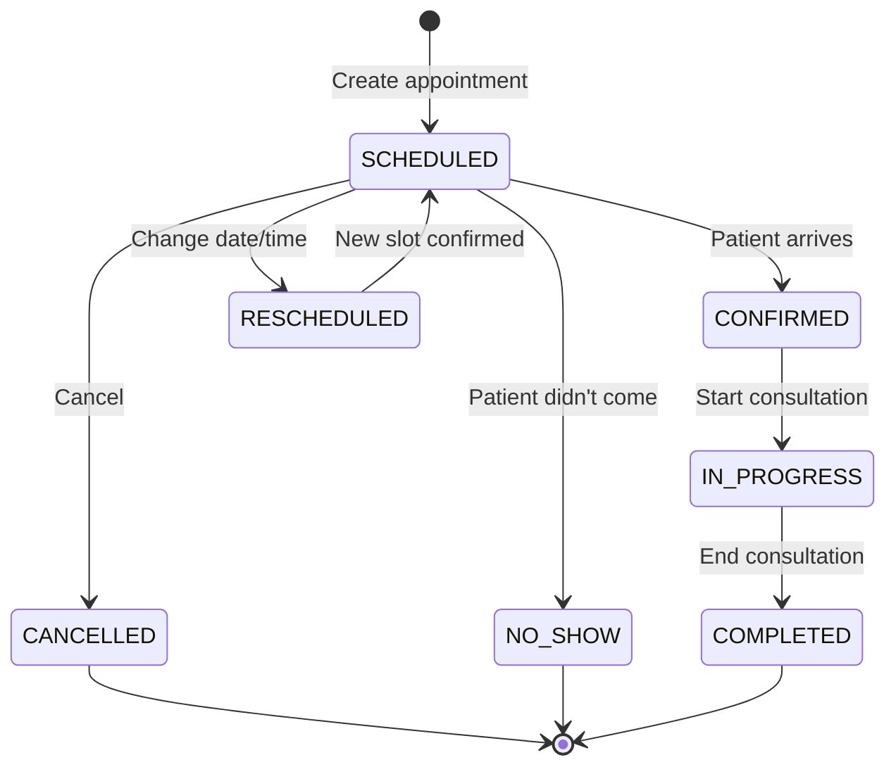

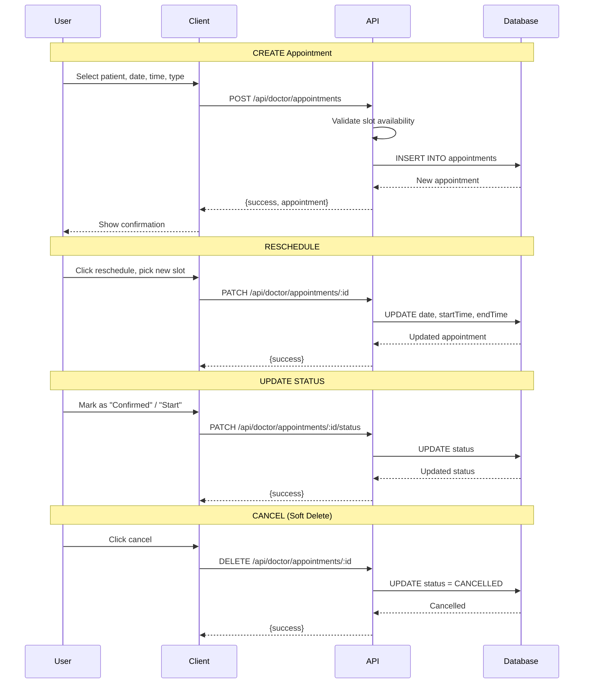

### 4. Consultation Flow (Core Doctor Workflow)

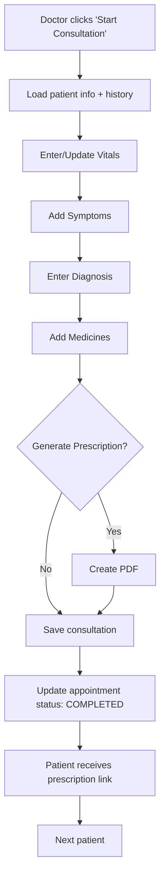

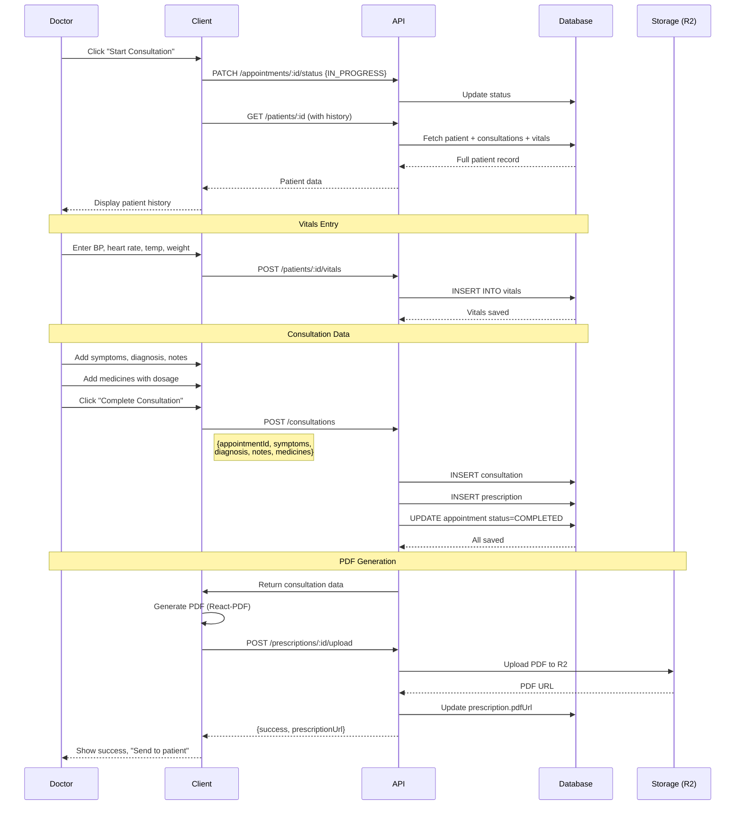

### 5. Prescription Generation Flow

```mermaid
flowchart LR
    A[Consultation Complete] --> B[Gather Data]
    B --> C[Clinic Header<br/>Logo + Name + Address]
    C --> D[Patient Info<br/>Name, Age, Gender]
    D --> E[Vitals Summary]
    E --> F[Diagnosis]
    F --> G[Medicines Table<br/>Name, Dosage, Duration]
    G --> H[Advice/Instructions]
    H --> I[Follow-up Date]
    I --> J[Doctor Signature]
    J --> K[Generate PDF]
    K --> L[Upload to R2]
    L --> M[Share via WhatsApp/Email]
```

### 6. Data Sync Architecture (Future - Offline Support)

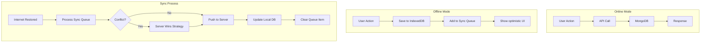

---

## Database Schema

### Entity Relationship Diagram

```mermaid
erDiagram
    USER ||--o| DOCTOR : "is a"
    USER ||--o| PATIENT : "is a"
    
    DOCTOR ||--o{ APPOINTMENT : "has many"
    PATIENT ||--o{ APPOINTMENT : "has many"
    
    APPOINTMENT ||--o| CONSULTATION : "has one"
    CONSULTATION ||--o| PRESCRIPTION : "has one"
    
    PATIENT ||--o{ VITALS : "has many"
    PATIENT ||--o{ MEDICAL_RECORD : "has many"
    PATIENT ||--o{ MEDICAL_NOTE : "has many"
    DOCTOR ||--o{ MEDICAL_NOTE : "writes"
    
    USER {
        uuid id PK
        string email UK
        string password
        string name
        enum role "DOCTOR|PATIENT|ADMIN|RECEPTIONIST"
        enum gender
        string phone
        datetime createdAt
        datetime updatedAt
        datetime deletedAt "soft delete"
    }
    
    DOCTOR {
        uuid id PK
        uuid userId FK
        string specialization
        string licenseNumber UK
        enum status "ACTIVE|INACTIVE|ON_LEAVE"
        json clinicInfo "name, address, logo"
        json availability "weekly schedule"
        datetime createdAt
        datetime updatedAt
    }
    
    PATIENT {
        uuid id PK
        uuid userId FK
        datetime dateOfBirth
        enum bloodType
        array allergies
        array currentMedications
        string emergencyContactName
        string emergencyContactPhone
        datetime createdAt
        datetime updatedAt
        datetime deletedAt "soft delete"
    }
    
    APPOINTMENT {
        uuid id PK
        uuid doctorId FK
        uuid patientId FK
        datetime date
        datetime startTime
        datetime endTime
        int duration
        string type
        enum status
        string room
        string notes
        datetime createdAt
        datetime updatedAt
        datetime deletedAt "soft delete"
    }
    
    CONSULTATION {
        uuid id PK
        uuid appointmentId FK UK
        json symptoms "array of symptom objects"
        string diagnosis
        string notes
        string icdCode "ICD-10 code"
        datetime createdAt
        datetime updatedAt
    }
    
    VITALS {
        uuid id PK
        uuid patientId FK
        int heartRate
        string bloodPressure
        float temperature
        float weight
        float height
        float spo2
        uuid recordedBy FK "user who recorded"
        datetime recordedAt
    }
    
    PRESCRIPTION {
        uuid id PK
        uuid consultationId FK UK
        json medicines "array of medicine objects"
        string advice
        datetime followUpDate
        string pdfUrl
        datetime createdAt
    }
    
    MEDICAL_RECORD {
        uuid id PK
        uuid patientId FK
        string title
        string type
        string description
        string fileUrl
        datetime recordDate
        datetime createdAt
    }
    
    MEDICAL_NOTE {
        uuid id PK
        uuid patientId FK
        uuid doctorId FK
        string note
        string diagnosis
        datetime createdAt
        datetime updatedAt
    }
```

### New Collections to Add (Mongoose Models)

- Add new collections by defining schemas in `backend/src/models`.
- Keep enum values aligned with `backend/src/types/enums.ts`.

model Prescription {
  id             String   @id @default(uuid())
  
  consultationId String   @unique
  consultation   Consultation @relation(fields: [consultationId], references: [id])
  
  medicines      Json     // [{name, dosage, frequency, duration, instructions}]
  advice         String?
  followUpDate   DateTime?
  
  pdfUrl         String?  // R2 storage URL
  
  createdAt      DateTime @default(now())

  @@map("prescriptions")
}

// Add deletedAt to existing models for soft delete
// Add to User, Patient, Appointment models:
// deletedAt DateTime?
```

---

## API Reference

### Authentication Endpoints

| Method | Endpoint | Description | Auth Required |
|--------|----------|-------------|---------------|
| POST | `/api/auth/login` | Login with email/password | No |
| POST | `/api/auth/logout` | Logout (invalidate token) | Yes |
| GET | `/api/auth/me` | Get current user profile | Yes |
| POST | `/api/auth/refresh` | Refresh access token | Yes (refresh token) |

### Doctor Endpoints

| Method | Endpoint | Description | Status |
|--------|----------|-------------|--------|
| GET | `/api/doctor/stats` | Dashboard statistics | 🔨 Build |
| GET | `/api/doctor/appointments` | List appointments (filterable) | ✅ Exists |
| GET | `/api/doctor/appointments/:id` | Get single appointment | 🔨 Build |
| POST | `/api/doctor/appointments` | Create appointment | 🔨 Build |
| PATCH | `/api/doctor/appointments/:id` | Update appointment (reschedule) | 🔨 Build |
| PATCH | `/api/doctor/appointments/:id/status` | Update status only | ✅ Exists |
| DELETE | `/api/doctor/appointments/:id` | Cancel appointment (soft) | 🔨 Build |
| GET | `/api/doctor/patients` | List all patients | ✅ Exists |
| GET | `/api/doctor/patients/:id` | Get patient with history | ✅ Exists |
| POST | `/api/doctor/patients` | Create new patient | 🔨 Build |
| PATCH | `/api/doctor/patients/:id` | Update patient info | 🔨 Build |
| POST | `/api/doctor/patients/:id/notes` | Add medical note | ✅ Exists |
| GET | `/api/doctor/patients/:id/vitals` | Get vitals history | 🔨 Build |
| POST | `/api/doctor/patients/:id/vitals` | Add vitals reading | 🔨 Build |
| GET | `/api/doctor/patients/:id/consultations` | Get consultation history | 🔨 Build |
| POST | `/api/doctor/consultations` | Save consultation | 🔨 Build |
| POST | `/api/doctor/prescriptions/:id/upload` | Upload prescription PDF | 🔨 Build |

### Patient Endpoints

| Method | Endpoint | Description | Status |
|--------|----------|-------------|--------|
| GET | `/api/patient/appointments` | My appointments | ✅ Exists |
| POST | `/api/patient/appointments` | Book appointment | ✅ Exists |
| DELETE | `/api/patient/appointments/:id` | Cancel my appointment | ✅ Exists |
| GET | `/api/patient/doctors` | List available doctors | ✅ Exists |
| GET | `/api/patient/medical-records` | My medical records | ✅ Exists |
| GET | `/api/patient/medical-notes` | My medical notes | ✅ Exists |
| GET | `/api/patient/prescriptions` | My prescriptions | 🔨 Build |

### Admin Endpoints

| Method | Endpoint | Description | Status |
|--------|----------|-------------|--------|
| GET | `/api/admin/doctors` | List all doctors | ✅ Exists |
| GET | `/api/admin/analytics` | System analytics | ✅ Exists |

### Response Format

All API responses follow this structure:

```typescript
// Success Response
{
  "success": true,
  "data": { ... },
  "message": "Optional success message"
}

// Error Response
{
  "success": false,
  "error": {
    "code": "VALIDATION_ERROR",
    "message": "Human readable message",
    "details": { ... }  // Optional field-level errors
  }
}
```

---

## Security & Compliance

### Authentication Security

- **Password Hashing**: bcrypt with 10 salt rounds
- **JWT Tokens**: 7-day expiration, signed with RS256
- **Refresh Tokens**: 30-day expiration (Phase 2)
- **Rate Limiting**: 100 requests/minute per IP (Phase 2)

### Data Protection (DPDP Act 2023 - India)

| Requirement | Implementation |
|-------------|----------------|
| **Data Minimization** | Collect only necessary patient data |
| **Purpose Limitation** | Medical data used only for treatment |
| **Storage Limitation** | Soft deletes, archival after 7 years |
| **Data Accuracy** | Patients can update their info |
| **Security** | Encryption at rest, TLS in transit |
| **Consent** | Explicit consent on registration |
| **Data Portability** | Export patient data as PDF/JSON |
| **Right to Erasure** | Anonymization (can't hard delete medical records) |

### Audit Trail

All sensitive operations logged:

```typescript
interface AuditLog {
  id: string;
  userId: string;
  action: 'CREATE' | 'READ' | 'UPDATE' | 'DELETE';
  resource: string;  // 'patient', 'appointment', etc.
  resourceId: string;
  changes: object;   // Before/after for updates
  ipAddress: string;
  timestamp: Date;
}
```

---

## Appendix

### Glossary

| Term | Definition |
|------|------------|
| **Consultation** | A single doctor-patient interaction during an appointment |
| **Vitals** | Measured health indicators (BP, heart rate, temperature, etc.) |
| **Prescription** | Document containing medicines and advice from consultation |
| **Soft Delete** | Mark record as deleted (set deletedAt) without removing from DB |

### References

- [Mongoose Documentation](https://mongoosejs.com/docs/)
- [TanStack Query](https://tanstack.com/query/latest)
- [React-PDF](https://react-pdf.org/)
- [DPDP Act 2023](https://www.meity.gov.in/data-protection-framework)
